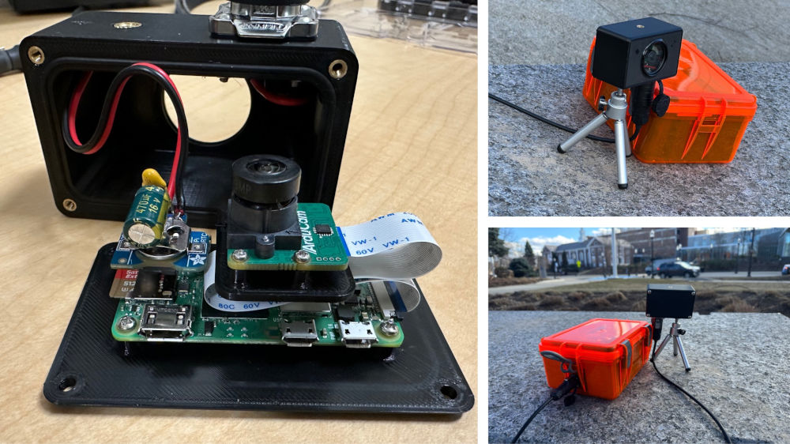
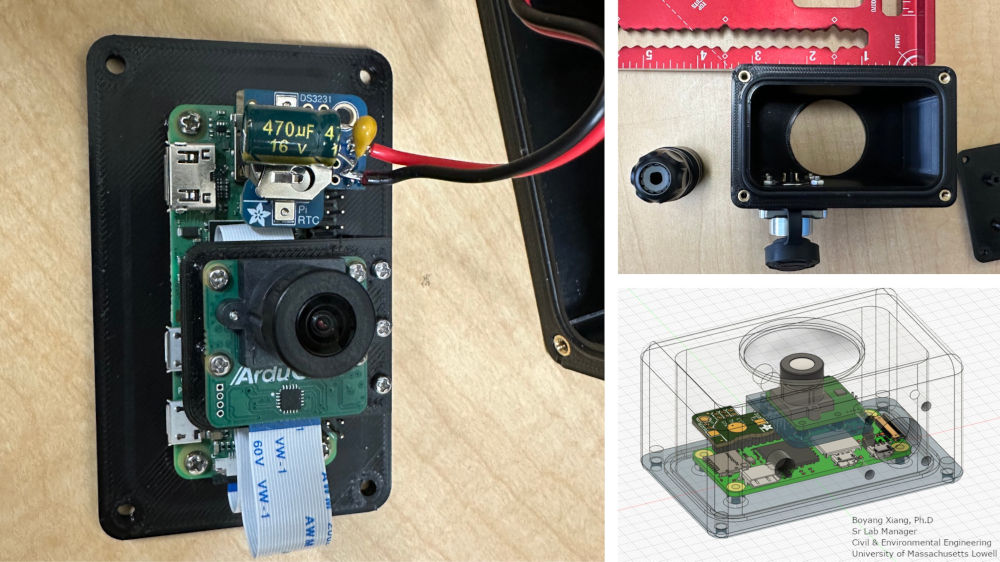

# Pi Zero 2 Low-Light All-Weather Camera

This project provides a **low-power, weatherproof, and long-term recording solution** using the **Raspberry Pi Zero 2 W** with a **low-light camera module**. Designed for outdoor environments, it can operate in **rain, snow, and extreme temperatures** while capturing video efficiently over extended periods. The system is optimized for **low power consumption**, **automatic file management**, and **reliable performance** in challenging lighting conditions. Whether for **wildlife monitoring, security, or time-lapse photography**, this project offers a compact and cost-effective solution.

## Features  
- 🚀 **No external WiFi or 5G required** – The Raspberry Pi Zero 2 W creates its own WiFi hotspot.  
- 🎥 **Wide variety of cameras supported** – Compatible with multiple camera modules.  
- 🖨️ **3D printed case** – Custom enclosure for durability and weather resistance.  
- 📽️ **Tested for 7 days of continuous video recording** – Proven reliability.  
- ⏳ **Flexible recording time** – Adjustable settings for long-term usage.  
- 🔗 **Remote SSH access and local video streaming** – Connect and control the camera even without an internet connection.  
- 🔋 **Low power consumption** – Designed for long-term operation on battery or solar power.  
- ☔ **Weatherproof design** – Adjustable settings for long-term usage.  

This system has been tested in an urban environment for recording trip generation data following ITE guidelines. It provides a cost-effective way to monitor vehicle, pedestrian, and cyclist activity over extended periods, even in low-light and adverse weather conditions, making it ideal for transportation research and analysis.

Special thanks to Boyang Xiang, Ph.D., Sr. Lab Manager, Civil & Environmental Engineering, UMass Lowell, for designing and 3D printing the custom enclosure for this project.